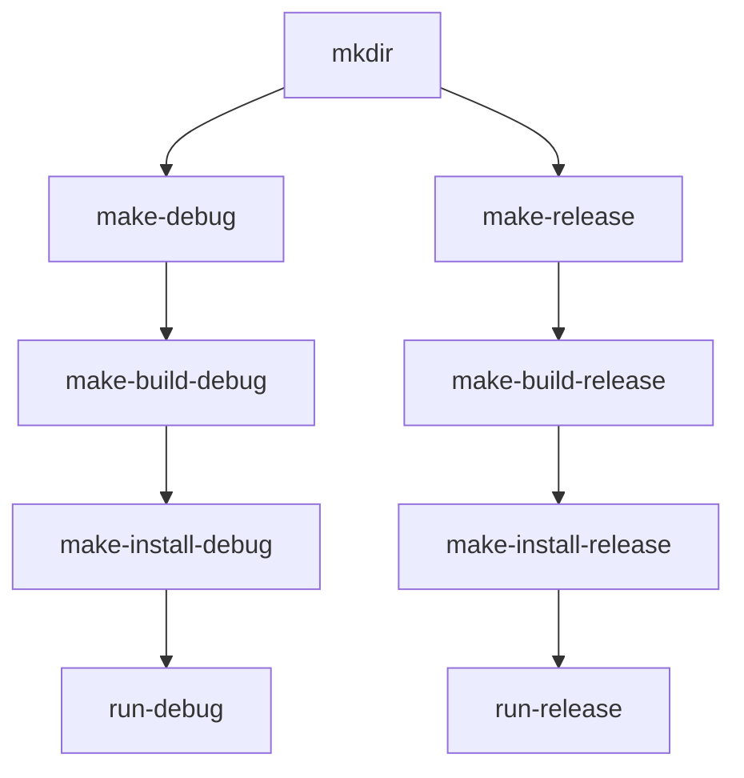

# IntMusic

## 简介

基于QT开发的桌面音乐播放器，支持音乐库管理、播放NAS中的音乐、智能歌单等功能。

## Todo
- [x] 有一个基本的界面
- [x] 音乐库
    - [x] 支持添加和读取单个音乐文件到数据库
    - [x] 支持批量
    - [ ] 支持修改和更新
- [x] 音频格式支持
    - [x] flac、mp3
    - [ ] dsf、dff
- [x] 正常解析以上音频文件的tag
- [ ] 支持逐字歌词
- [ ] 支持读取百度网盘和阿里云盘的音乐
- [ ] 支持智能歌单
- [ ] 支持年度报告
- [ ] 支持DLNA

## 开发（VS Code）

### 环境

编译环境使用https://github.com/int233/qt-docker中的Dcoker

```powershell
git clone https://github.com/int233/qt-docker.git
cd qt-docker
docker build -f Dockerfile.windows.shared -t qt-build-windows:shared.6.8.3 .
```

### 下载

```powershell
git clone https://github.com/int233/MusicPlayer.git
cd MusicPlayer
git checkout QT
```
### 编译

#### build IntMusic via terminal
```powershell
docker run --rm -v "{IntMusic_Folder}:/project" qt-build-windows:shared.6.8.3  bash -c "cmake -B /project/build/debug/ -S /project  -DCMAKE_TOOLCHAIN_FILE=/opt/mxe/usr/x86_64-w64-mingw32.shared/share/cmake/mxe-conf.cmake -DCMAKE_BUILD_TYPE=Release && cmake --build /project/build/debug && cmake --install /project/build/debug --prefix /project/build/debug"

```
#### build IntMusic via vscode

- [tasks.json 文件](.vscode/tasks.json)中存在debug和release两条构建链：



- [launch.json 文件](.vscode/launch.json)利用[tasks.json](.vscode/tasks.json)中的`make-install-debug`生成应用程序并调试。