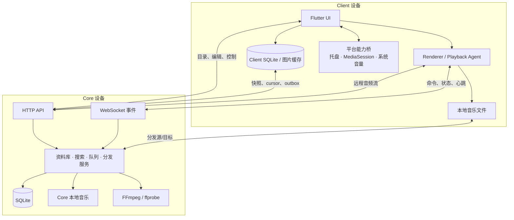
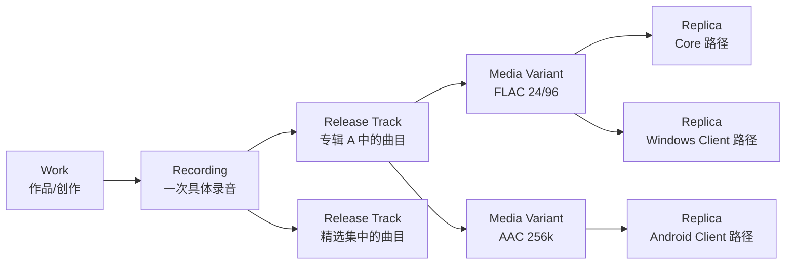

# IntMusic 总体架构

本文描述 IntMusic 1.2 的系统边界、数据模型和关键运行流程。具体的 Flutter 源码约束见 [Client v2 架构约束](client-v2-architecture.md)，弱网状态机与播放会话演进见 [弱网与离线架构](client-core-resilience-v3.md)。

## 设计目标

IntMusic 的目标不是把所有音乐文件复制进一台服务器，而是建立一个能够理解“歌曲身份、发行关系、媒体版本和物理位置”的统一资料库，并让每个设备都能在在线、弱网和离线环境中获得一致的浏览与播放体验。

系统遵循以下原则：

1. 音乐文件始终由用户控制，可以位于 Core 或任意 Client。
2. Core 是资料库身份、编辑结果、播放区域和跨设备协调的权威来源。
3. Client 的前台界面优先读取本地投影，网络请求不能阻塞已缓存内容的浏览。
4. 播放控制、媒体数据和目录同步使用不同通道，某一通道变慢不应拖垮其他功能。
5. Flutter 承担产品 UI；平台原生代码只实现系统级能力。

## 系统拓扑



## Core 与 Client 的职责

### Core

Core 是无界面 Rust 服务，负责：

- SQLite 数据库迁移、统一资料库和音乐身份关系。
- Core 本地目录扫描、标签读取、封面与歌词提取。
- Client 文件清单接收、设备/来源生命周期和副本可用性。
- 专辑、艺术家、歌曲、歌单、收藏、历史和评分数据。
- CJK 友好的全文搜索与本地同步快照。
- 播放区域、队列、模式、状态和跨 Client 控制协调。
- 音频流、媒体分发、校验、临时中继和 FFmpeg 转码。
- HTTP API、WebSocket 事件、mDNS 发现与诊断日志。

Windows 正式安装时 Core 作为 `IntMusicCore` 服务运行；在其他平台可以使用 `core-cli serve` 或相应服务管理器启动。

### Client

Client 是 Flutter 应用，负责：

- 资料库浏览、搜索、导航、响应式布局和主题。
- 歌曲、专辑、艺术家、歌词、歌单与资料库管理界面。
- 当前设备的 renderer、队列投影、播放控制和进度上报。
- 本地音乐文件夹扫描、嵌入标签解析和 manifest 上传。
- 本地目录镜像、图片缓存、离线副本和离线操作 outbox。
- 分发任务的源文件上传、目标下载、校验与原子落盘。
- 通过统一平台桥接调用托盘、媒体中心、系统音量和后台服务。

Client 不直接读写 Core 数据库，也不能在页面层复制 Core 的队列或合并算法。

## 音乐身份模型

同名文件不一定是同一首歌，同一首歌也可能有多个发行、编码和物理副本。IntMusic 将目录拆分为四个主要身份层级，并在媒体层下面记录实际位置。



### Work

表示抽象作品，例如词曲创作本身。翻唱可以共享 Work，但不会共享 Recording。

### Recording

表示一次具体演唱或录音。录音室版、Live 版、重录版和不同演唱者的版本通常是不同 Recording。收藏和播放统计可以在产品层按需要投影，但不能因此抹去录音差异。

### Release Track

表示某次发行中的曲目位置。相同 Recording 可以同时出现在原始专辑、精选集和再版专辑中；每个 Release Track 保留自己的专辑、曲序、封面、发行年份和歌词时间轴。

### Media Variant 与 Replica

Media Variant 表示编码、码率、采样率、位深或母带不同的媒体版本。Replica 表示某个版本在 Core 或 Client 上的实际文件位置。相同文件分布在不同设备时只增加 Replica，不增加歌曲条目。

自动合并只处理足够可靠的相同发行曲目副本。标题相同但专辑、版本、曲序、年份或时长存在实质差异时，应保留独立身份或由用户手动关联。

## 数据平面

IntMusic 将通信分为四类，避免弱网时互相阻塞。

| 平面 | 内容 | 主要机制 |
| --- | --- | --- |
| Catalog | 资料库、详情、图片索引、歌单、收藏 | revision/cursor、SQLite 投影、后台刷新 |
| Control | 播放、暂停、切歌、seek、音量、队列编辑 | 有界超时的 HTTP 命令、幂等 command ID |
| Event | 播放状态、资料变更、分发进度 | WebSocket、事件 cursor、断线续传 |
| Media | 音频流、分发上传下载、封面文件 | 本地路径、Range HTTP、临时文件与校验 |

前台页面不能因为 Event 或 Media 通道正在重连而清空 Catalog 投影。

## 资料库同步与离线

### Core 本地目录

Core 直接扫描可访问路径，使用 Rust `library-scanner` 和 Lofty 读取标签。扫描结果写入统一数据库，文件删除或来源停用时保留可管理的历史状态，直到用户明确清理。

### Client 本地目录

Client 使用稳定的设备 ID、来源 ID 和文件相对标识生成 manifest。Core 接收标签和媒体参数后创建或更新媒体副本关系。文件本身不会随 manifest 上传。

一次完整扫描使用 `scan_id` 对账：本轮出现的文件标为可用，未出现的历史文件标为缺失，而不是立刻永久删除。这样临时存储卸载和权限中断不会破坏资料关系。

### 本地投影

Client 保存资料库摘要、详情、搜索数据、图片和本机副本映射。正常流程是：

1. 启动后立即读取本地投影并绘制页面。
2. 后台连接 Core，比较 `server_id`、`catalog_epoch` 和同步 cursor。
3. 拉取变化并原子更新本地投影。
4. 当前页面以 stale-while-revalidate 方式静默刷新。

断网时，收藏和历史等操作写入带唯一 mutation ID 的 outbox；重连后幂等提交。切换到不同 Core 或 `catalog_epoch` 改变时，Client 会清理过期身份缓存并重新建立映射。

## 播放架构

每个可播放输出对应一个 zone。Core 本机、Client 默认输出以及 Client 枚举到的音频设备都可以成为 zone。

播放会话包含：

- 稳定的 session、epoch 和 revision。
- 带稳定 item ID 的队列及当前索引。
- 顺序、随机、单曲循环和列表循环模式。
- 当前曲目、位置、状态和 renderer 所有权。
- 播放器音量与系统输出端点音量两个独立层级。

所有入口——页面按钮、底部控制栏、键盘媒体键、Windows SMTC、macOS Now Playing 和 Android MediaSession——最终调用同一组队列命令。renderer 完播后根据同一状态机选择下一项，UI 不自行猜测下一首。

媒体选择按以下顺序考虑：

1. 当前 renderer 上可访问的本地副本。
2. 其他符合偏好的可用媒体版本。
3. Core 可直接提供的文件或转码流。
4. 不可用时给出明确状态，而不是用无标签占位记录覆盖资料。

## 分发与转码

分发任务由 Core 协调：

1. 用户选择曲目、目标设备和质量配置。
2. Core 选择最佳源副本。
3. 若源位于另一 Client，源 Client 流式上传到 Core 临时中继。
4. Core 校验大小与 quick hash，并按固定 profile 调用 FFmpeg。
5. 目标 Client 下载到临时文件，校验后原子移动到目标目录。
6. 新文件进入下一次 manifest，同一歌曲增加媒体版本或副本。

FFmpeg 参数来自代码内白名单，API 不能注入任意命令。转码缓存和临时中继均有生命周期管理。

## 平台结构

Flutter 是 Windows、macOS 和 Android 的共同产品层。统一 MethodChannel `dev.intmusic/platform` 暴露能力，不允许页面直接创建平台通道。

| 能力 | Windows | macOS | Android |
| --- | --- | --- | --- |
| 常驻入口 | 系统托盘 | 菜单栏 | 前台媒体通知 |
| 系统媒体控制 | SMTC / AppCommand | MPRemoteCommandCenter | MediaSessionCompat |
| 窗口材质 | Mica/DWM 降级 | Liquid Glass/Visual Effect 降级 | edge-to-edge Flutter surface |
| 系统音量 | 当前输出端点 | 当前输出设备 | 系统媒体音量能力范围内 |
| 后台行为 | 托盘常驻 | 菜单栏常驻 | 前台服务与 MediaSession |

平台能力初始化必须返回 capability；Flutter 根据结果启用功能，而不是只根据操作系统名称假设能力存在。

## 仓库结构

```text
crates/
  core-api/          HTTP、WebSocket、运行时与路由编排
  core-db/           SQLite 迁移、查询和资料库身份
  core-cli/          Core 启动与管理命令
  core-daemon/       Windows 服务入口
  core-config/       配置、路径和默认值
  library-scanner/   Core 本地标签、封面与歌词扫描
  search-index/      FTS 与 CJK n-gram 搜索
  playback/          队列和播放会话状态机
  audio-engine/      解码与 DSP 抽象
  output-*/          平台音频输出
  transcoder/        FFmpeg profile、缓存与校验
  protocol/          DTO、OpenAPI 与事件契约
apps/
  client-flutter/    Windows、macOS、Linux、Android Client
  client-harmony/    HarmonyOS 实验性客户端
packaging/           安装器、服务、FFmpeg 和发布说明
scripts/             环境、构建、安装与发布脚本
docs/                产品、架构和用户文档
```

## 协议与演进约束

- HTTP 接口以 `crates/protocol/openapi.yaml` 为契约。
- WebSocket 事件必须登记在 `crates/protocol/events.schema.json`。
- 数据库只能通过按顺序执行的 migration 演进；已经发布的 migration 不得修改。
- 删除或合并身份必须可追踪，资料库管理操作不能静默删除物理文件。
- Client 必须能够处理旧缓存失效、Core 重启、端口变化和事件遗漏。
- 页面不能直接访问 Core SQLite；SQL 只能位于 `core-db`。
- 合入前至少通过 Rust 格式、Clippy、测试，Flutter analyze、测试和架构检查。

## 网络边界

默认 Core 监听 `0.0.0.0:49330`，并可在 `49330–49360` 中自动选择端口。mDNS 服务为 `_intmusic-core._tcp.local.`。默认设计面向可信局域网；将 Core 直接暴露到公网并不是推荐部署方式。跨网络访问应使用受控 VPN 或未来的认证与 TLS 入口，不应仅依赖端口映射。
