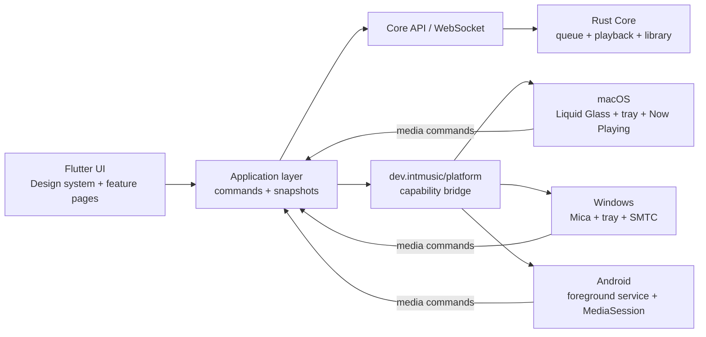

# IntMusic Client v2 架构约束

本文档是 Windows、macOS 与 Android 客户端的共同实现契约。新增功能应遵循这里的状态归属和依赖方向，避免平台实现与 Flutter 页面相互渗透。

## 一条主线、三个平台壳

- Flutter 是唯一的产品 UI 主体，页面、交互、响应式布局和业务编排共用一套代码。
- Rust Core 是播放队列、播放模式、分区音量、媒体库和历史记录的唯一事实来源。
- 原生层只负责系统无法由 Flutter 等价完成的能力：窗口材质、托盘/菜单栏、媒体会话、后台生命周期和系统媒体键。
- 原生回调只能产生 `play`、`pause`、`togglePlayPause`、`previous`、`next`、`stop`、`showWindow`、`quit` 等命令，不能在平台侧复制队列算法。

## 状态归属

| 状态 | 唯一来源 | 持久化 | 分发方式 |
| --- | --- | --- | --- |
| 媒体库、收藏、播放列表 | Rust Core / SQLite | 是 | REST + Core event |
| 本机媒体副本与离线目录快照 | Flutter client | 是 | Client manifest + SharedPreferences |
| 离线收藏与播放历史 outbox | Flutter client，重连后 Core | 是 | 幂等 mutation batch |
| 播放队列与当前索引 | Rust Core / SQLite | 是 | REST + `playback.queue_changed` |
| 播放模式 | Rust Core / SQLite | 是 | queue snapshot |
| zone 音量与静音 | Rust Core / SQLite | 是 | REST + renderer command |
| 播放位置与 transport state | 当前 renderer / Core | 运行时 | renderer report + Core event |
| 主题、语言、客户端别名 | Flutter client | 是 | SharedPreferences |
| 托盘、锁屏、系统媒体面板 | 平台投影 | 否 | `dev.intmusic/platform` |

## Client 媒体库与分发

- Client 文件始终由该设备持有；Core 保存统一曲目身份、媒体版本和副本位置，不把不同发行版的 release track 合并掉。
- 内容指纹相同的文件可以成为同一媒体版本的多个副本；码率、编码、母带或发行版不同则保留独立版本关系。
- 分发优先使用 Core 本机副本。仅存在于 Client 的源文件由源 Client 领取 source task，流式上传至 Core 临时中继缓存，通过大小和 quick hash 校验后进入转码/交付阶段。
- FFmpeg 仅随 Core 分发，Client 不执行转码。转码参数来自固定白名单 profile，不能从 API 注入任意命令行参数。
- 目标 Client 使用临时文件、断点下载、大小与 quick hash 校验和原子替换写入音乐文件夹；Android 通过 SAF 持久权限读写。

Flutter 不根据本地曲目列表推算下一首；平台媒体中心也不自行跳转。所有入口最终调用同一组 Core queue API，因此 UI 按钮、键盘媒体键、macOS 控制中心、Windows SMTC 和 Android 锁屏不会产生不同状态。

## 平台能力矩阵

| 能力 | macOS | Windows | Android |
| --- | --- | --- | --- |
| 原生背景材质 | macOS 26 `NSGlassEffectView`，旧版 `NSVisualEffectView` | Windows 11 Mica，旧版 DWM 自动降级 | 系统 edge-to-edge + Flutter surface |
| 常驻入口 | `NSStatusItem` | `Shell_NotifyIcon` | MediaStyle 前台通知 |
| 系统媒体控制 | `MPRemoteCommandCenter` | SMTC + `WM_APPCOMMAND` | `MediaSessionCompat` |
| 关闭行为 | 隐藏窗口、菜单栏常驻 | 隐藏窗口、托盘常驻 | 返回键移至后台 |
| Flutter 不可用时 | 原生显示能力静默降级 | 原生显示能力静默降级 | 媒体通知保留最后快照 |

平台初始化必须返回 capabilities。Flutter 只能依据 capability 打开增强功能，不能依据操作系统名称假定 API 一定可用。

## UI 设计系统

`IntMusicTheme` 提供语义色、圆角、玻璃模糊与层级表面。页面组件不得新增散落的品牌色常量；旧常量只作为迁移兼容层。

- Canvas：带低对比度环境光，不使用纯黑大平面。
- Glass：仅用于导航、播放控制、弹层等高层级表面，避免每张卡片都模糊。
- Raised surface：列表、专辑卡片、设置项等内容层。
- Accent：播放与选择使用玫红；统计和次级提示使用暖金；播放在线状态使用绿色。
- 动效：页面切换和播放器展开使用 180–280ms，尊重系统“减少动态效果”设置。
- 自适应：`< 760` 为紧凑播放器，`>= 980` 显示内联音量；桌面默认窗口至少 920×620。

## Core queue API

- `GET/POST /api/v1/zones/{zone_id}/queue`
- `POST /api/v1/zones/{zone_id}/queue/items`
- `DELETE /api/v1/zones/{zone_id}/queue/items/{item_id}`
- `POST /api/v1/zones/{zone_id}/queue/move`
- `POST /api/v1/zones/{zone_id}/queue/mode`
- `POST /api/v1/zones/{zone_id}/next`
- `POST /api/v1/zones/{zone_id}/previous`
- `GET/POST /api/v1/zones/{zone_id}/volume`

队列突变必须增加 `revision` 并广播完整快照。renderer 完播后由 Core 前进队列；客户端只上报停止状态，不能自行选择下一曲。

## 合并门槛

涉及客户端架构的变更至少需要：

1. `cargo test --workspace`
2. `flutter analyze`
3. `flutter test`
4. macOS 原生变更执行 `flutter build macos`
5. Android 原生变更在配置 Android SDK 的 CI 执行 debug APK 构建
6. Windows 原生变更在 Windows CI 执行 runner 编译
7. 至少完成一个桌面宽度和一个紧凑宽度的视觉检查

任何新平台功能都应先扩充 capability bridge 和本表，不得从页面直接创建新的 MethodChannel。
