# IntMusic 详细功能

本文按用户任务描述 IntMusic 1.2 当前代码中的主要功能和预期行为。界面文字可能因平台、窗口宽度和语言设置略有不同。

本文中的界面截图均来自 macOS 客户端。同一能力在 Windows 和 Android 上会遵循相同的数据模型，但控件密度、导航形式和系统集成会按平台调整。

## macOS 功能截图索引

- [资料库浏览](#资料库浏览)：首页、专辑、艺术家、歌曲和搜索入口。
- [播放与队列](#播放与队列)：播放页、歌词区域和底部控制栏。
- [歌单](#歌单)：普通/智能歌单、歌单详情和规则编辑器。
- [元数据编辑](#元数据编辑)：歌曲、歌词和艺术家编辑器。
- [资料库管理](#资料库管理)：总览、全部文件、设备与来源。
- [音乐分发](#音乐分发)：专辑级操作和目标设备分发入口。
- [系统集成与诊断](#系统集成与诊断)：Core 连接、文件夹和客户端设置入口。

## 资料库浏览

### 首页

- 展示资料库概况、最近内容、播放入口和常用导航。
- 先使用 Client 本地缓存绘制，再在后台刷新 Core 数据。
- 桌面端使用侧边栏；紧凑宽度使用可收起导航。

### 专辑

- 画廊和列表视图，可按名称等字段排序与筛选。
- 专辑详情展示封面、参与人员、光盘分组、曲序和可用性。
- 多碟专辑按 Disc 显示分隔，不把曲序相同的不同光盘混在一起。
- 同一专辑身份下，同一 Recording 位于相同光盘/曲序时只显示一个目录条目；媒体副本在版本区域折叠展示。

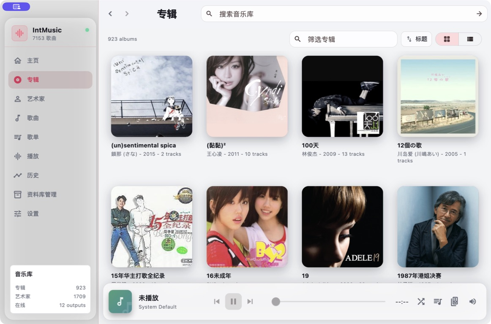

_专辑画廊支持筛选、排序，以及画廊/列表视图切换。_

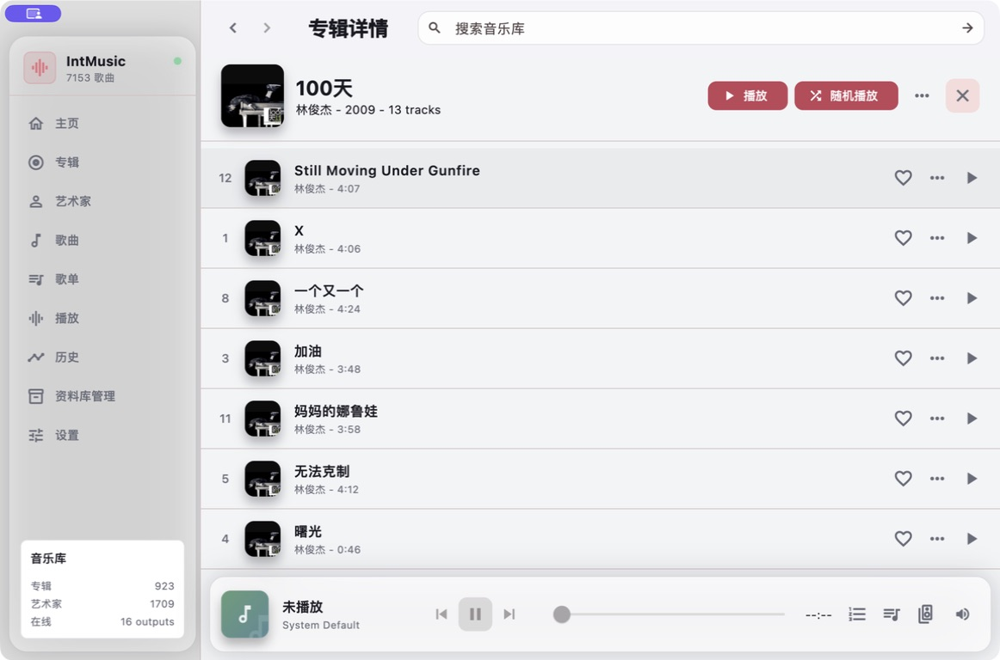

_专辑详情把发行信息、曲序、批量播放和逐曲操作放在同一页面。_

### 艺术家

- 画廊和列表视图，支持搜索和排序。
- 详情页展示资料、专辑、歌曲和人工维护的艺术照。
- 艺术照支持多张图片、分类、最多五个裁剪区域和组合头像预览。
- 艺术家对象可以被歌曲、专辑与 credits 关联，避免只保存不可跳转的纯文本。

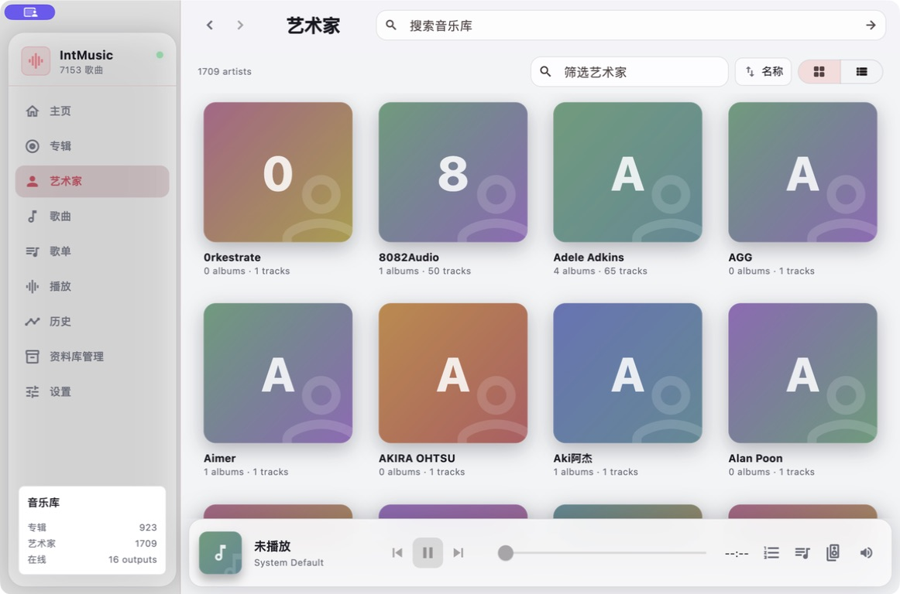

_艺术家页面可以在画廊和列表之间切换，并提供本页筛选。_

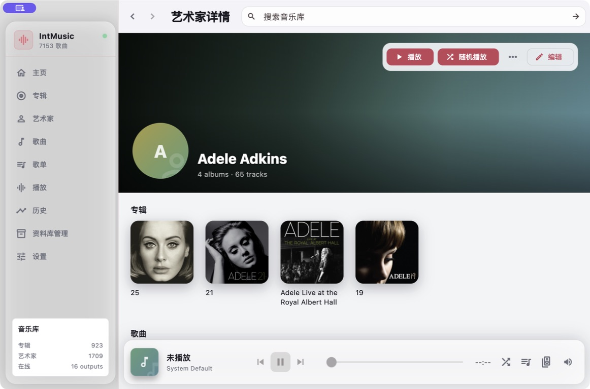

_艺术家详情使用横幅、头像、专辑和歌曲组织信息，并在右上角提供编辑入口。_

### 歌曲

- 列表和画廊视图，支持筛选、排序、批量选择和搜索。
- 行内显示标题、艺术家、专辑、时长、收藏状态和当前可用性。
- 可用性标签根据本机副本、Core 副本、其他设备副本和网络状态实时计算。
- 同一 Recording 的多设备或多编码副本在目录层折叠，在详情中展开。

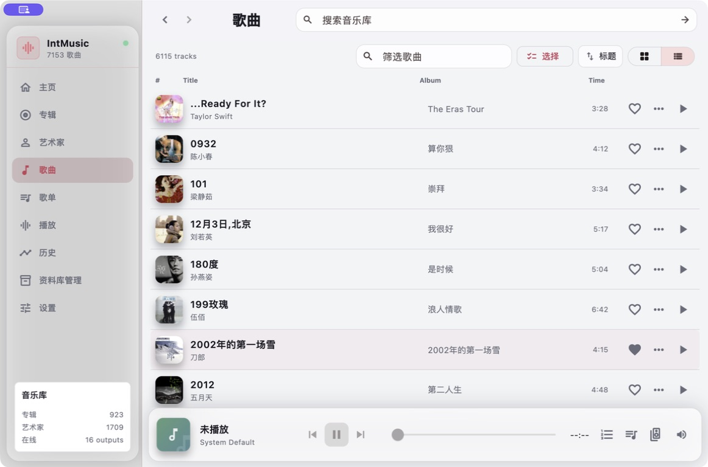

_歌曲列表展示标题、艺术家、专辑、时长和常用操作；筛选、排序、批量选择始终位于列表上方。_

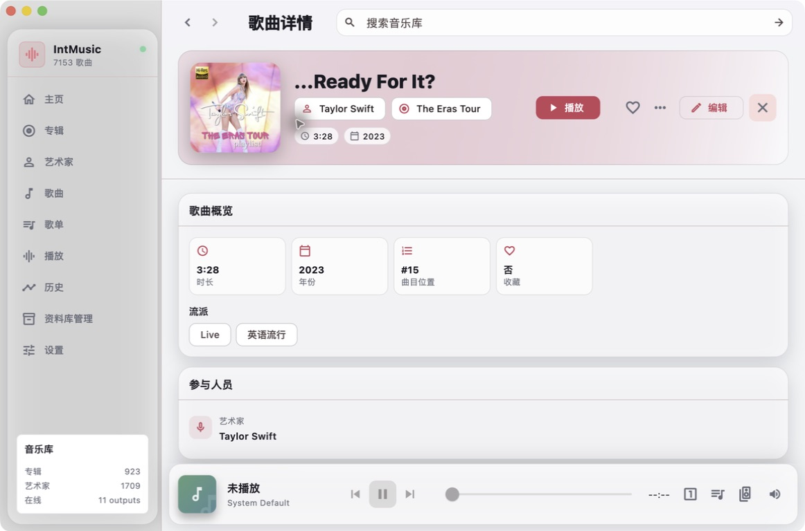

_歌曲详情将封面和可跳转的艺术家/专辑信息放在首屏，后续区域继续展示参与人员、版本和歌词。_

### 搜索

- 搜索歌曲、专辑、艺术家和歌单。
- Core 使用 SQLite FTS 与 CJK n-gram，兼顾中文和拉丁文本。
- Client 可以使用本地搜索投影，不必等待每次网络往返。

## 音乐身份与版本

歌曲详情中的“版本与可用位置”按以下关系展示：

- 作品与具体录音关系。
- 当前发行专辑、曲序和其他收录。
- FLAC、M4A、MP3、AAC 等媒体版本。
- 每个版本在 Core 或 Client 上的副本。
- 每个文件的格式、大小、码率、采样率、位深、声道、修改时间、路径与校验时间。

播放时系统根据当前 renderer 的本地可访问性、媒体质量和 Core 可用性选择副本。目录中的一个歌曲条目不等于一个物理文件。

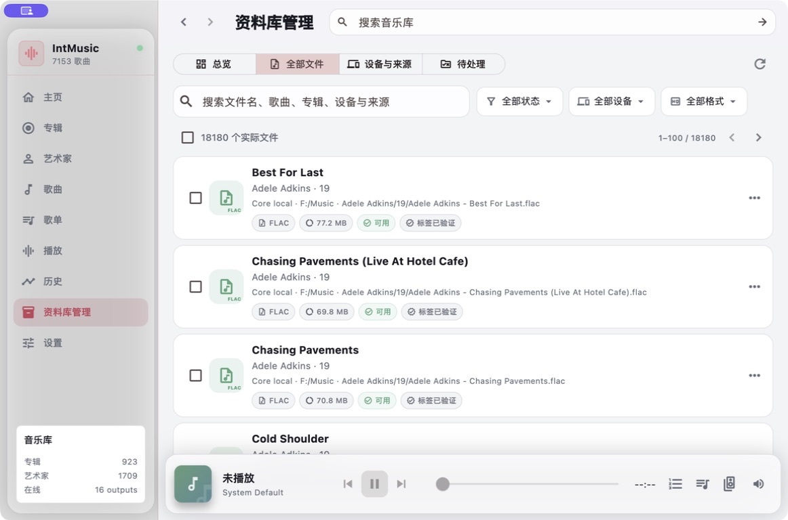

_物理文件在资料库管理中单独展示；一个目录歌曲可以对应多个这样的媒体副本。_

## 播放与队列

### 底部播放控制栏

- 显示封面、标题、艺术家、播放状态和进度。
- 提供上一首、播放/暂停、下一首、随机、队列、设备和音量入口。
- 紧凑屏幕会重排或隐藏次要控件，避免遮挡主要信息。

### 播放页面

- 展示大封面、歌曲信息、进度、收藏、播放模式和完整控制。
- 宽屏可以使用歌词/详情双栏，窄屏在单栏之间平滑切换。
- 首尾歌词保留安全留白，当前行不会紧贴视口边缘。

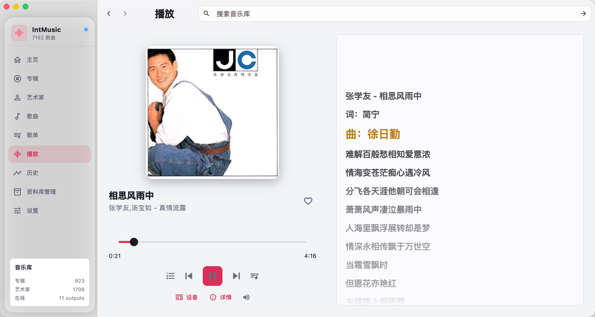

_宽屏播放页把封面与控制放在左侧、歌词放在右侧；底部控制栏在此页面收起，避免重复。_

### 待播放列表

- 显示稳定队列顺序、当前项和后续曲目。
- 打开时定位到当前播放项，而不是每次回到队首。
- 支持移动、删除、清空、下一首播放和追加到队尾等操作。
- 顺序、随机、单曲循环和列表循环由统一状态机处理。

### 导航历史

- 页面提供前进与后退按钮。
- 从歌单、专辑或搜索结果进入详情后返回，会恢复原列表与滚动位置。

## 播放设备与区域

- Core 本机和每个在线 Client 都可以成为播放区域。
- Client 可枚举当前系统允许访问的实际音频输出，而不只显示默认设备。
- 可将当前播放转移到其他区域，也可以选择多个区域播放。
- 设备页可将当前 Client 置顶，并按名称或“正在播放优先”排序。
- 离线时只保留当前设备实际可用的区域，不把离线 Client 错标为 Core。

_设备与来源页面显示 Core、各 Client、在线状态、文件数量和实际音乐来源；播放设备弹层复用同一设备身份。_

### 音量

IntMusic 将音量分为两层：

- **播放器音量**：IntMusic 对当前 zone 的软件增益。
- **系统音量**：renderer 当前输出端点的系统音量。

音量弹层同时显示两个滑块，不需要切换标签。远程控制时，系统音量命令发送给拥有该输出的 Client；不支持端点控制的平台会明确降级，而不是假装成功。

外接音响或显示器自身的硬件音量不属于当前功能范围。

## 歌单

### 普通歌单

- 创建、重命名、删除歌单。
- 添加或移除歌曲，并按歌单顺序播放。
- 从任意歌曲列表使用更多菜单或批量操作加入歌单。

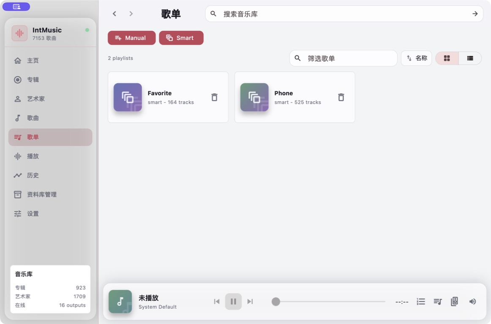

_歌单首页区分普通歌单和智能歌单，并提供筛选、排序和视图切换。_

### 智能歌单

- 使用规则自动生成内容。
- 支持多个条件和匹配方式。
- 规则可按收藏、评分、播放历史、艺术家、专辑、年份、格式和歌曲来源等字段筛选。
- 来源规则使用设备/来源选项，不要求用户手工输入内部 ID。

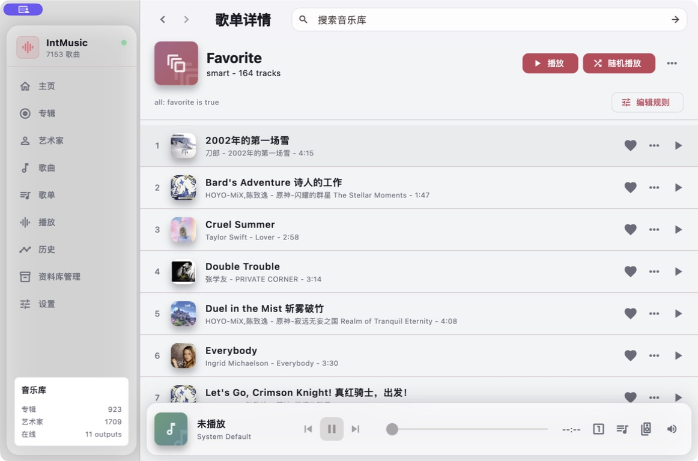

_智能歌单详情显示规则摘要和动态结果，播放时采用当前可见的稳定顺序。_

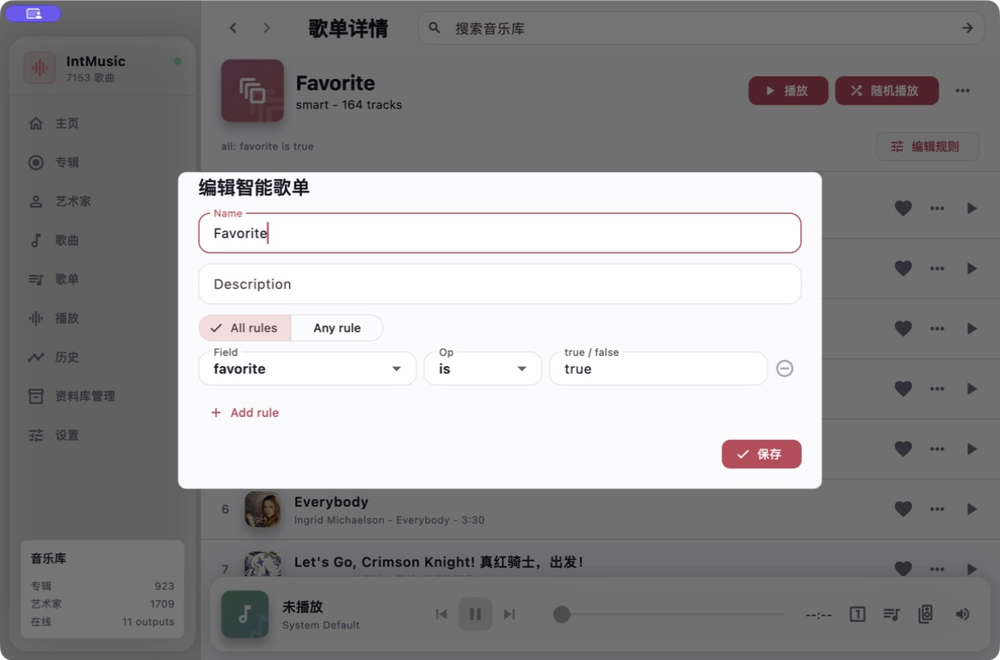

_规则编辑器支持“全部匹配/任一匹配”、多条件组合和结构化字段值。_

## 收藏、评分与历史

- 收藏按钮在列表、详情、播放页面和队列中保持一致。
- 可兼容文件标签评分与 IntMusic 用户评分，并按设置决定最大评分是否视为收藏。
- 播放历史、播放次数和最近播放由 Core 汇总。
- 离线收藏与历史使用唯一 mutation ID 暂存，重连后幂等同步。
- 合并歌曲时保留并汇总收藏等用户状态，不应因选择新的 canonical track 而丢失。

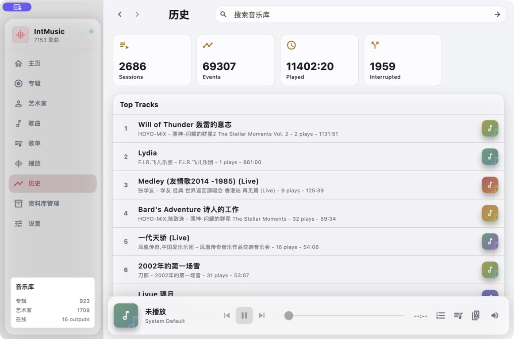

_历史页面汇总会话、事件、累计时长、中断次数和高频歌曲。_

## 歌词

### 格式与渲染

- 纯文本歌词。
- LRC 逐行时间轴。
- 逐字时间轴与当前字高亮。
- 原文、翻译和注音层。
- 不同演唱者/角色标记。
- 当前行居中、非当前行弱化、点击行 seek 和自动滚动。

只有普通 LRC 时仍可完整测试逐行渲染；逐字、翻译和注音能力需要相应数据才能展示最终效果。

### 歌词编辑器

- 编辑原始歌词与时间标签。
- 播放试听并为行或字设置时间。
- 编辑翻译、注音、演唱者和修订记录。
- 保存前检查时间顺序和格式错误。

歌词时间轴属于具体 Release Track；同一 Recording 的不同发行可以共享基础文本，但允许保留独立封面、母带和时间偏移。

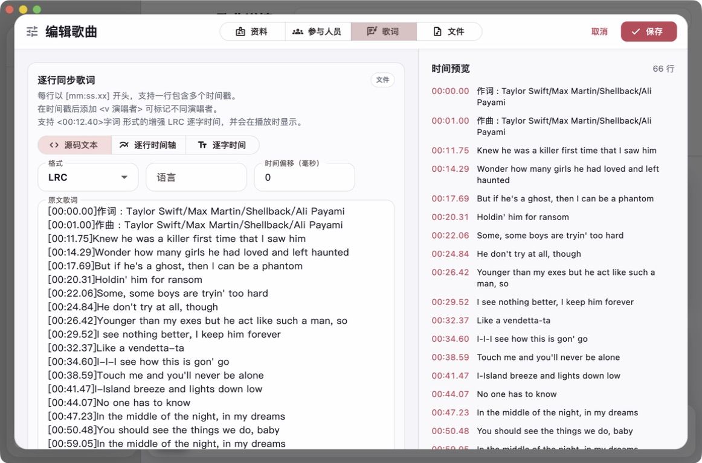

_歌词编辑器同时显示原始 LRC、逐行/逐字模式和时间预览，便于校验时间轴。_

## 元数据编辑

### 歌曲编辑

- 标题、排序标题、版本副标题、日期、年份、BPM、注释和评分。
- 主要艺术家、专辑艺术家、作曲、作词、流派等多值字段。
- 专辑、光盘号、曲序和总数。
- 歌词及其时间轴。
- 手动将某个 Release Track 关联到已有 Recording，或撤销关联。

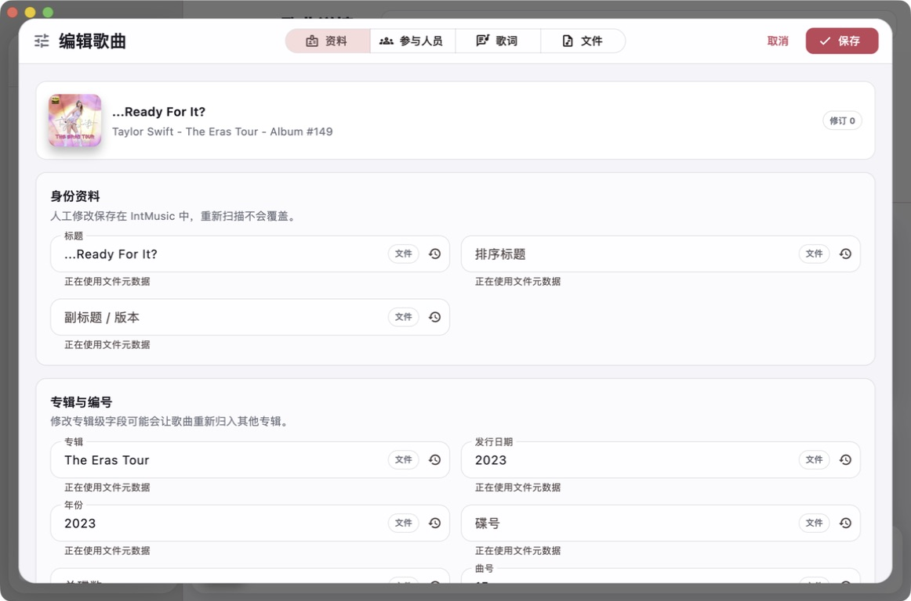

_歌曲编辑器按资料、参与人员、歌词和文件分栏；每个字段会标明当前值来自文件还是人工覆盖。_

### 专辑编辑

- 标题、排序标题、版本、发行类型、日期、原始发行日期、年份、国家、条码、目录号、厂牌和版权等信息。
- 专辑艺术家、演唱者、制作人、作曲、作词、工程、发行方等多对象 credits。
- 对选中歌曲批量传播专辑字段，同时允许个别歌曲保留独立信息。
- 将错误或重复专辑迁移到目标专辑；目标保留自己的封面与资料，来源曲目及副本完整迁入。

### 艺术家编辑

- 名称、排序名、MusicBrainz ID、类型、国家、活动日期、简介和外部链接。
- 手动上传 JPG、PNG、WebP 等 Flutter/图片引擎可解码格式。
- 为头像、横幅、背景和组合成员等显示区域选择不同图片或裁剪区域。

当前设计以手动资料维护为主，不依赖自动抓取艺术照。

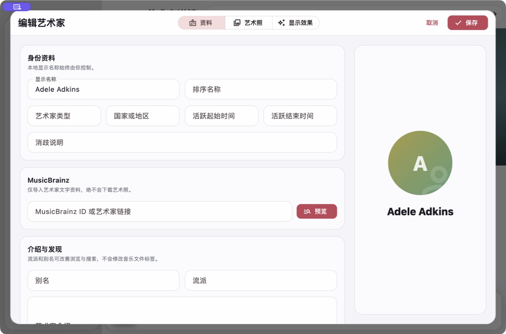

_艺术家编辑器把身份资料、MusicBrainz 引用、简介、艺术照和显示效果分开维护。_

## 资料库管理

资料库管理覆盖所有文件，而不仅是异常队列。

### 总览

- 设备、来源、文件、容量、可用数量和问题数量统计。
- 区分在线、离线、已停用、已移除、缺失和待处理状态。

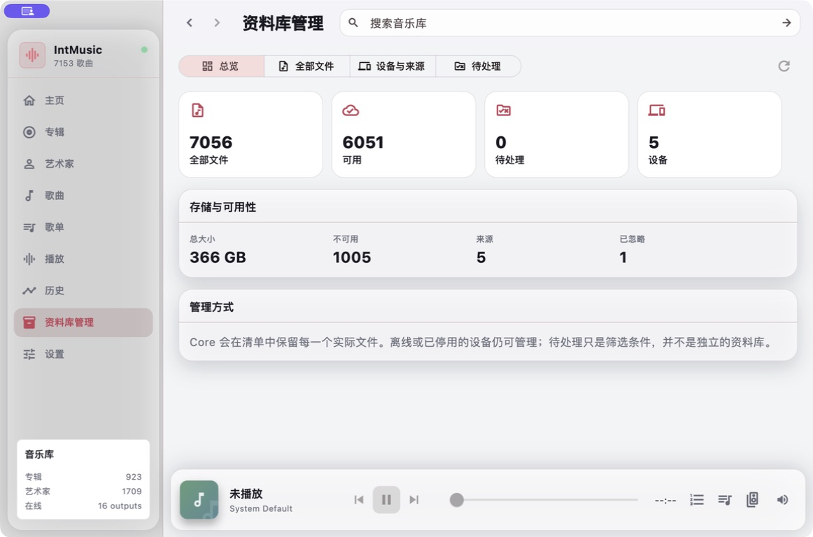

_总览用文件、可用副本、待处理项和设备四组指标概括资料库健康状况。_

### 全部文件

- 分页、搜索、设备/来源/格式/状态筛选。
- 查看嵌入标签、媒体参数、Core 绑定、路径和问题历史。
- 多选后批量停用、恢复、忽略、重新扫描或删除目录记录。

_全部文件页面提供状态、设备和格式筛选，并在每个文件卡片上显示绑定与标签校验状态。_

### 设备与来源

- 停用暂时不应参与资料库的设备或来源。
- 永久移除重复安装产生的旧设备身份及其目录记录。
- 删除设备或来源后，歌曲详情不应继续显示已经移除的副本。
- 物理文件删除后先标为缺失，用户可以重新扫描、恢复来源或明确清理记录。

_每台设备下继续按音乐来源分组，卸载后的旧 Client、停用来源和缺失文件仍可被显式管理。_

### 待处理文件

- 无标题/艺术家标签、解析失败和需要复核的文件进入待处理列表。
- 可以补录嵌入资料，或将文件关联到已有歌曲。
- 不使用文件名和父目录猜测权威元数据。

### 重复项与关联

- “查找完全重复歌曲”按标准化标题、艺术家集合、专辑、版本、年份、光盘/曲序、录音类型和时长生成保守候选。
- 用户确认后将不同编码或设备副本折叠到一个 Release Track。
- 不同专辑中的相同 Recording 通过录音关联表达，不直接删除各自发行曲目。
- 合并历史可用于撤销和诊断。

## Client 本地音乐与离线

- 每个 Client 可以添加自己的本地文件夹。
- Client 读取文件内嵌标签，只向 Core 上传 manifest，不上传音频正文。
- Core 返回稳定的 track/media binding，Client 保存本机副本映射。
- 断网时继续显示缓存的歌曲、专辑、艺术家、歌单、封面和详情。
- 本机有副本的歌曲可以直接播放；只有远程副本的歌曲显示不可用。
- 网络从正常变慢、断开、重连到恢复同步时，不清空当前资料库或重置队列。

Android 目录通过系统文件选择器与持久权限访问。HarmonyOS 兼容层或虚拟化环境可能只暴露部分 Android 存储，界面应区分“路径存在”和“应用持有可读写授权”。

## 音乐分发

- 支持单曲、专辑、艺术家、歌单和歌曲页多选分发。
- 目标为已注册且具有可写音乐来源的 Client。
- 质量可以选择原始文件或固定 FLAC/AAC profile。
- 源文件位于 Client 时，经 Core 临时中继；位于 Core 时直接读取。
- 目标使用断点、临时文件、校验和原子替换，失败不会留下看似完整的损坏文件。
- 分发完成后通过本地扫描进入统一资料库。

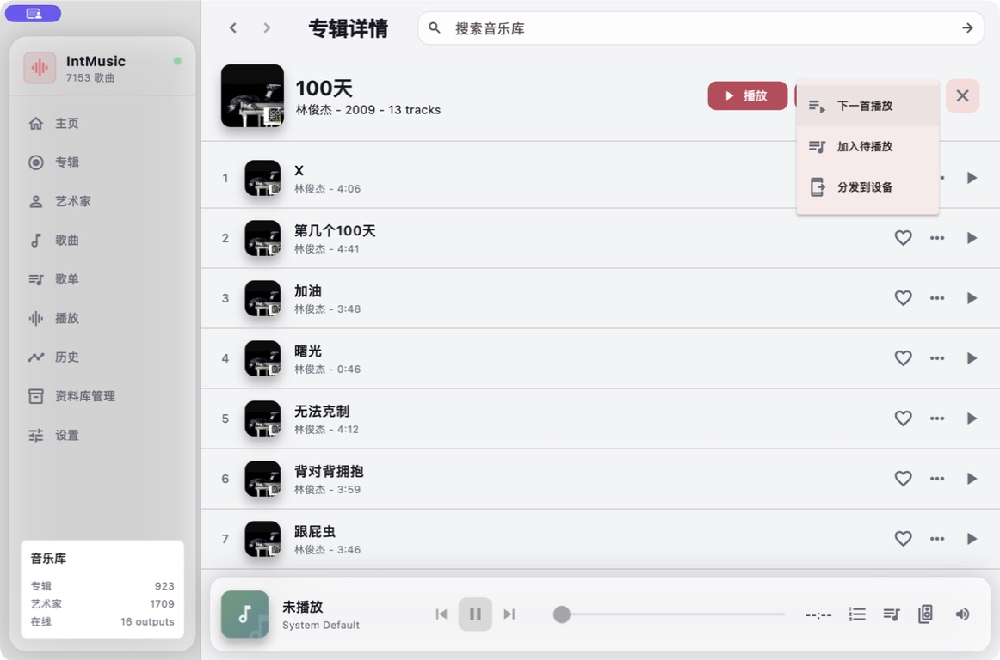

_单曲、专辑、歌单和批量选择都通过统一操作菜单进入“分发到设备”。_

## 主题与界面

- macOS 跟随系统浅色/深色外观；其他当前支持平台默认使用深色产品主题。
- 桌面透明材质、背景模糊和平台能力降级。
- 桌面侧边栏在阈值变化时使用收起/展开动画。
- 紧凑布局针对 Android 720p/1080p 和桌面窄窗口重排标题、操作按钮、列表列和底部播放器。
- 列表、画廊和详情页面共享语义色、圆角、表面层级和动效时长。

## 系统集成与诊断

- Windows 托盘菜单控制显示、播放和退出，安装器负责停止 Client 与 Core 服务后更新。
- macOS 菜单栏、原生窗口按钮安全区和 Now Playing。
- Android 前台媒体通知、锁屏控制与后台播放。
- 可开关详细播放日志，记录控制请求、媒体选择、超时、回退和 renderer 状态。
- 日志可以导出为 JSONL；Android 使用可用的分享/文件保存流程，不调用未实现的桌面保存路径。
- Core 提供状态与 diagnostics 接口，Windows 安装记录保存在 ProgramData 的 IntMusic 目录。

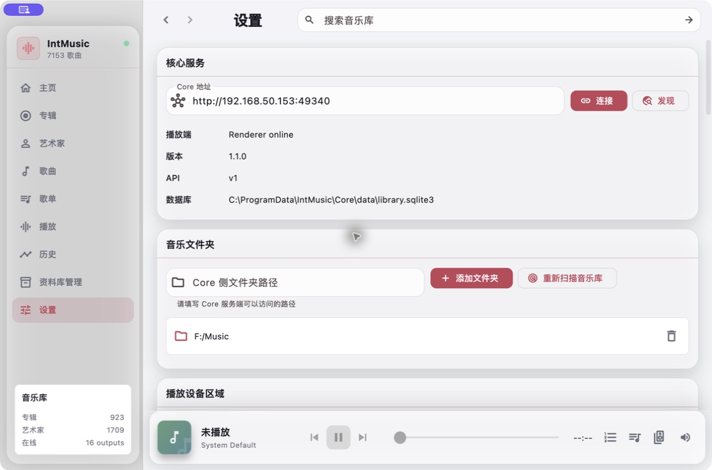

_设置页集中管理 Core 连接、Core 音乐文件夹、播放区域、本机音乐、转码、分发、外观和诊断。截图中的地址和路径仅代表本机测试环境。_

## 当前边界

- 默认面向局域网，不建议把未配置认证和 TLS 的 Core 直接暴露到公网。
- Client v3 弱网播放会话仍在持续收敛，旧接口在迁移期保持兼容。
- 硬件功放/显示器自身音量、云音乐服务登录与网络音乐商店不属于当前范围。
- 自动元数据匹配保持保守策略；不确定的 Recording 或发行关系需要人工确认。
